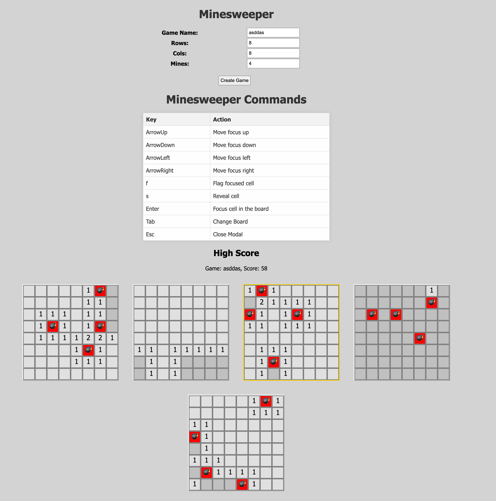

# Minesweeper Game

Welcome to the Minesweeper Game repository! This project is a web-based implementation of the classic Minesweeper game, built using HTML, CSS, and JavaScript.



## Table of Contents

- [Features](#features)
- [Installation](#installation)
- [Usage](#usage)
- [Game Rules](#game-rules)
- [Customization](#customization)
- [Contributing](#contributing)
- [License](#license)

## Features

- Create custom game boards with configurable rows, columns, and mines.
- Reveal cells and flag potential mines.
- Track high scores.
- Responsive design for various screen sizes.
- Simple and intuitive user interface.

## Installation

To run this project locally, follow these steps:

1. Clone the repository:
   ```bash
   git clone https://github.com/luisfilipebandeira/mineSweeper.git
   ```

2. Navigate to the project directory:
   ```bash
   cd minesweeper
   ```

3. Open the `index.html` file in your preferred web browser:
   ```bash
   open index.html
   ```
   Or simply double-click the `index.html` file.

## Usage

1. Open the game in your web browser.
2. Enter the desired game name, number of rows, columns, and mines.
3. Click the "Create Game" button to start a new game.
4. Click on cells to reveal them or press the 'F' key to flag/unflag mines.
5. Try to reveal all non-mine cells without triggering any mines.

## Game Rules

- **Objective**: Reveal all non-mine cells.
- **Revealing Cells**: Click on a cell to reveal it. If the cell contains a mine, the game is over. If not, it will show the number of adjacent mines.
- **Flagging Mines**: Press the 'F' key while hovering over a cell to flag or unflag it as a mine. This helps you keep track of where you think mines are located.

## Customization

You can customize the game by editing the HTML, CSS, and JavaScript files. Here are a few things you might want to change:

- **Board Size**: Adjust the default number of rows, columns, and mines in the `index.html` file.
- **Styles**: Modify the `styles.css` file to change the appearance of the game.
- **Game Logic**: Edit the `script.js` file to tweak game mechanics or add new features.

## Contributing

Contributions are welcome! If you have any ideas, improvements, or bug fixes, feel free to open an issue or submit a pull request.

1. Fork the repository.
2. Create a new branch:
   ```bash
   git checkout -b feature-name
   ```
3. Make your changes and commit them:
   ```bash
   git commit -m 'Add some feature'
   ```
4. Push to the branch:
   ```bash
   git push origin feature-name
   ```
5. Open a pull request.

## License

This project is licensed under the MIT License. See the [LICENSE](LICENSE) file for details.

---

Thank you for checking out our Minesweeper game! We hope you enjoy playing it as much as we enjoyed building it. If you have any feedback or questions, please don't hesitate to reach out.
